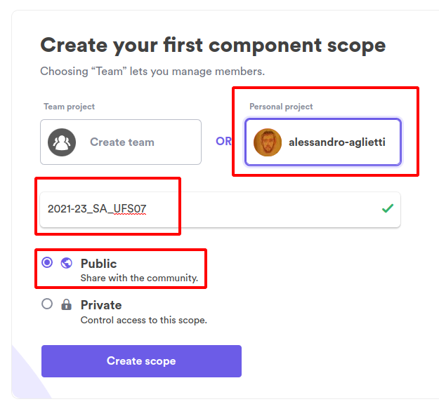
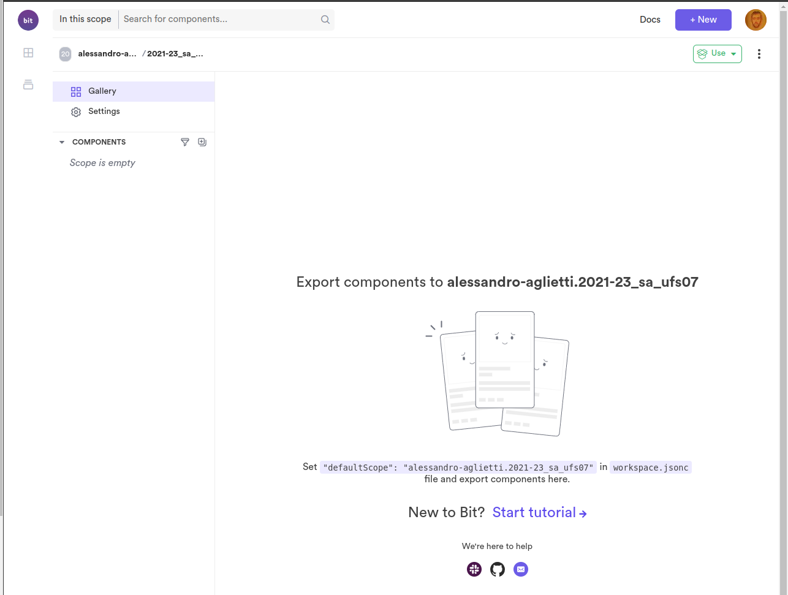

# bit.cloud / bit.dev

0. NVM check and clean working directory
1. creare account su bit.cloud
2. installare bit CLI
3. 

## NVM check and clean working directory

Ricordarsi sempre di avere il file .nvmrc ed aver usato `nvm install` e poi `nvm use` prima di iniziare a lavorare.

Inoltre assicurarsi da source control che la nostra working directory non abbia nessuna modifica pending e quindi che possiamo iniziare a lavorare.

### init design-system folder

I componenti sono uno scope a se' stante rispetto all'applicazione quindi dobbiamo inzializzare un nuovo package.json all'interno di questa directory.

`npm init`

## creare account su bit.cloud

Aprire https://bit.cloud/ e creare account!

Quando vi chiede come configurare fare come segue.

Alla fine vedremo uno spazio vuoto.

Copiamo l'URL del nostro spazio vuoto (e pubblico) e scriviamolo qua sotto!

https://bit.cloud/alessandro-aglietti/2021-23_sa_ufs07

## installare bvm aka the bit.cloud CLI

`npx @teambit/bvm install`

se il comando `bit --version` ritorna errore come se `bit` non fosse installato sara' sufficiente

`echo 'export PATH=$HOME/bin:$PATH' >> ~/.bashrc`

poi chiudere e riaprire il terminale e ritentare `bit --version`.
